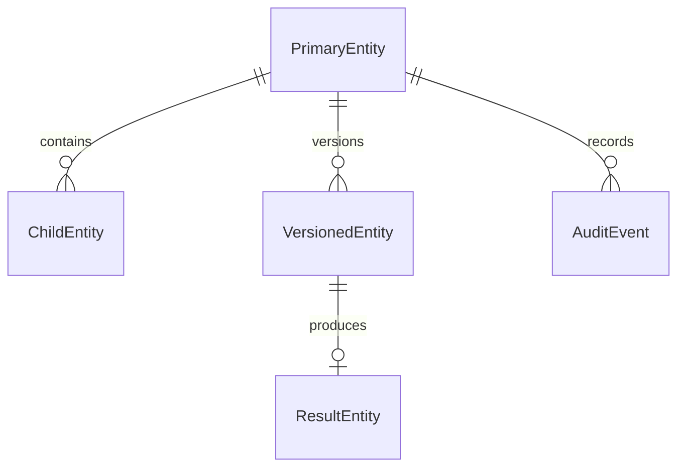

# {{PROJECT_NAME}} データモデル

<!-- ../README.md の規約に従ってプレースホルダーを置換し、不要なコメントと節を削除する。 -->

## 文書情報

| 項目 | 内容 |
| --- | --- |
| ステータス | {{STATUS}} |
| 最終更新日 | {{DATE}} |
| 対象データストア | {{DATA_STORE}} |
| オーナー | {{DOCUMENT_OWNER}} |
| 関連文書 | [仕様書](spec.md)、[技術設計書](plan.md)、[テスト仕様書](tests.md) |

## 1. 目的

{{DATA_MODEL_PURPOSE}}

本データモデルは次の要件を満たす。

- {{DATA_REQUIREMENT_1}}
- {{DATA_REQUIREMENT_2}}
- データ所有者とアクセス権を判定できる。
- 更新競合と重複処理を検出できる。
- スキーマ変更後もデータの形式を判別できる。
- 保持、削除、監査の要件を適用できる。

## 2. 設計方針

- すべての永続化データに一意な ID とスキーマバージョンを持たせる。
- 日時は UTC の ISO 8601 形式で保存する。業務上必要な場合は元のタイムゾーンも保存する。
- 金額は浮動小数点数を避け、通貨コードと最小通貨単位の整数で表現する。
- クライアントが送信した所有者 ID を信用せず、認証情報からサーバー側で設定する。
- 更新可能なデータには楽観的同時実行制御を適用する。
- 監査対象の事実は上書きせず、追記またはバージョン追加で記録する。

## 3. 用語

| 用語 | 定義 |
| --- | --- |
| 集約 | 一貫性を保って更新するデータのまとまり |
| 正本 | 同じ情報が複数箇所にある場合の正式な参照元 |
| 所有者 | データを参照・更新できる利用者、組織、テナント |
| 論理削除 | データを残したまま通常の参照対象から除外すること |

## 4. エンティティ関係

<!-- ノード ID は英数字にし、表示名だけをプレースホルダーへ置換する。 -->



| エンティティ | 説明 | 正本 | 所有者 |
| --- | --- | --- | --- |
| `{{PRIMARY_ENTITY}}` | {{PRIMARY_ENTITY_DESCRIPTION}} | {{PRIMARY_SOURCE_OF_TRUTH}} | {{PRIMARY_OWNER}} |
| `{{CHILD_ENTITY}}` | {{CHILD_ENTITY_DESCRIPTION}} | {{CHILD_SOURCE_OF_TRUTH}} | {{CHILD_OWNER}} |
| `{{RESULT_ENTITY}}` | {{RESULT_ENTITY_DESCRIPTION}} | {{RESULT_SOURCE_OF_TRUTH}} | {{RESULT_OWNER}} |
| `AuditEvent` | 重要操作の監査証跡 | {{AUDIT_SOURCE_OF_TRUTH}} | {{AUDIT_OWNER}} |

## 5. 共通属性

| 属性 | 型 | 必須 | 説明 |
| --- | --- | --- | --- |
| `id` | string | 必須 | 一意な識別子 |
| `schemaVersion` | integer | 必須 | データ形式のバージョン |
| `ownerId` | string | 条件付き | 所有者。認証情報からサーバー側で設定する |
| `tenantId` | string | 条件付き | マルチテナントの場合のテナント ID |
| `createdAt` | string | 必須 | UTC の作成日時 |
| `updatedAt` | string | 必須 | UTC の最終更新日時 |
| `createdBy` | string | 必須 | 作成者またはサービスの識別子 |
| `correlationId` | string | 必須 | 分散トレースとの相関 ID |
| `version` | integer または string | 条件付き | 楽観的同時実行制御に使用する値 |

データストアが付与する ETag、更新時刻、連番などがある場合は、共通属性との役割を明記する。

## 6. エンティティ定義

### 6.1 {{PRIMARY_ENTITY}}

{{PRIMARY_ENTITY_DESCRIPTION}}

| 属性 | 型 | 必須 | 説明 | 検証ルール |
| --- | --- | --- | --- | --- |
| `{{PRIMARY_FIELD_1}}` | {{TYPE}} | 必須 | {{FIELD_DESCRIPTION}} | {{VALIDATION_RULE}} |
| `{{PRIMARY_FIELD_2}}` | {{TYPE}} | 任意 | {{FIELD_DESCRIPTION}} | {{VALIDATION_RULE}} |
| `status` | enum | 必須 | 現在状態 | 定義済みの値だけを許可する |

### 6.2 {{CHILD_ENTITY}}

{{CHILD_ENTITY_DESCRIPTION}}

| 属性 | 型 | 必須 | 説明 | 検証ルール |
| --- | --- | --- | --- | --- |
| `{{PRIMARY_ENTITY_ID_FIELD}}` | string | 必須 | 親エンティティ ID | 存在と所有者を検証する |
| `{{CHILD_FIELD_1}}` | {{TYPE}} | 必須 | {{FIELD_DESCRIPTION}} | {{VALIDATION_RULE}} |
| `sequence` | integer | 条件付き | 親の中での順序 | 単調増加または一意 |

### 6.3 {{VERSIONED_ENTITY}}

{{VERSIONED_ENTITY_DESCRIPTION}}

| 属性 | 型 | 必須 | 説明 | 検証ルール |
| --- | --- | --- | --- | --- |
| `revision` | integer | 必須 | エンティティ内の版 | 親の中で一意 |
| `status` | enum | 必須 | `DRAFT`、`ACTIVE`、`SUPERSEDED` など | 状態遷移に従う |
| `content` | object | 必須 | 版ごとの内容 | スキーマで検証する |
| `sourceIds` | array | 任意 | 入力または根拠となる ID | 所有者を検証する |

### 6.4 {{RESULT_ENTITY}}

{{RESULT_ENTITY_DESCRIPTION}}

| 属性 | 型 | 必須 | 説明 | 検証ルール |
| --- | --- | --- | --- | --- |
| `targetId` | string | 必須 | 処理対象 ID | 対象の存在を検証する |
| `result` | enum | 必須 | 成功、失敗、判定不能など | 定義済みの値だけを許可する |
| `details` | object | 任意 | 結果の詳細 | サイズと機密情報を検証する |
| `processedAt` | string | 必須 | 処理日時 | UTC |

### 6.5 Approval

<!-- 明示承認を扱わない場合は削除する。 -->

| 属性 | 型 | 必須 | 説明 |
| --- | --- | --- | --- |
| `targetId` | string | 必須 | 承認対象 ID |
| `targetVersion` | string | 必須 | 承認対象の版 |
| `contentHash` | string | 必須 | 正規化した承認対象のハッシュ |
| `status` | enum | 必須 | `APPROVED`、`REVOKED`、`EXPIRED`、`CONSUMED` |
| `approvedBy` | string | 必須 | 承認者 ID |
| `approvedAt` | string | 必須 | 承認日時 |
| `expiresAt` | string | 任意 | 有効期限 |

承認後に対象内容が変化した場合、既存承認を無効にして再承認を求める。

### 6.6 IdempotentOperation

<!-- 副作用のある外部処理がない場合は削除する。 -->

| 属性 | 型 | 必須 | 説明 |
| --- | --- | --- | --- |
| `idempotencyKey` | string | 必須 | 重複防止キー |
| `requestHash` | string | 必須 | 要求内容のハッシュ |
| `status` | enum | 必須 | `PROCESSING`、`SUCCEEDED`、`FAILED`、`UNKNOWN` |
| `externalId` | string | 任意 | 外部システムの処理 ID |
| `attemptCount` | integer | 必須 | 試行回数 |
| `lastAttemptAt` | string | 必須 | 最終試行日時 |
| `result` | object | 任意 | 正規化した結果 |

### 6.7 AuditEvent

| 属性 | 型 | 必須 | 説明 |
| --- | --- | --- | --- |
| `eventType` | string | 必須 | 操作の種別 |
| `actorType` | enum | 必須 | `USER`、`SERVICE`、`SYSTEM` など |
| `actorId` | string | 必須 | 実行者 ID |
| `targetType` | string | 必須 | 操作対象の種別 |
| `targetId` | string | 必須 | 操作対象 ID |
| `outcome` | string | 必須 | 結果分類 |
| `occurredAt` | string | 必須 | 発生日時 |
| `details` | object | 任意 | 機密情報を除いた追加情報 |

## 7. 状態遷移

| 現在状態 | イベント | 次状態 | 条件 | 副作用 |
| --- | --- | --- | --- | --- |
| `{{CURRENT_STATE}}` | `{{EVENT}}` | `{{NEXT_STATE}}` | {{TRANSITION_CONDITION}} | {{SIDE_EFFECT}} |

不正な状態遷移は拒否し、状態と副作用を部分的に更新しない。

## 8. 物理データモデル

### 8.1 保存単位

| テーブル・コンテナ・コレクション | キーまたはパーティション | 主なエンティティ | 保持期間 |
| --- | --- | --- | --- |
| `{{STORAGE_UNIT_1}}` | `{{PARTITION_OR_PRIMARY_KEY}}` | {{ENTITIES}} | {{RETENTION_PERIOD}} |
| `{{STORAGE_UNIT_2}}` | `{{PARTITION_OR_PRIMARY_KEY}}` | {{ENTITIES}} | {{RETENTION_PERIOD}} |

### 8.2 インデックス

| ID | 対象 | キー | 対応アクセスパターン | 一意性 |
| --- | --- | --- | --- | --- |
| IDX-001 | `{{STORAGE_UNIT_1}}` | `{{INDEX_FIELDS}}` | Q-001 | {{UNIQUENESS}} |

本文、大きな配列、バイナリ、検索不要な属性は、データストアに応じてインデックス対象外とする。

## 9. アクセスパターン

| ID | アクセス | 条件 | 並び順 | 想定件数 |
| --- | --- | --- | --- | --- |
| Q-001 | {{QUERY_DESCRIPTION}} | {{QUERY_CONDITION}} | {{SORT_ORDER}} | {{EXPECTED_CARDINALITY}} |
| Q-002 | {{QUERY_DESCRIPTION}} | {{QUERY_CONDITION}} | {{SORT_ORDER}} | {{EXPECTED_CARDINALITY}} |

物理設計は主要アクセスパターン、データ量、更新頻度、トランザクション境界に基づいて決定する。

## 10. 整合性ルール

1. {{INTEGRITY_RULE_1}}
2. {{INTEGRITY_RULE_2}}
3. 関連データの所有者またはテナントは一致しなければならない。
4. 承認対象のハッシュと実行対象のハッシュは一致しなければならない。
5. 同じ冪等性キーで成功する副作用は最大1件とする。
6. 結果不明の場合、新規実行の前に既存結果を照会する。
7. 更新はバージョンまたは ETag を条件として実行し、競合を検出する。

## 11. トランザクションと同時実行

| 操作 | 原子性が必要な更新 | 境界 | 競合時の動作 |
| --- | --- | --- | --- |
| {{OPERATION}} | {{ATOMIC_CHANGES}} | {{TRANSACTION_BOUNDARY}} | {{CONFLICT_BEHAVIOR}} |

単一トランザクションに含められない外部処理は、Outbox、Saga、補償処理、状態照会などから適切な方式を選ぶ。

## 12. データ分類と保持

| データ | 分類 | 暗号化 | ログ出力 | 保持期間 | 削除方法 |
| --- | --- | --- | --- | --- | --- |
| {{DATA_1}} | {{CLASSIFICATION}} | {{ENCRYPTION}} | {{LOG_POLICY}} | {{RETENTION_PERIOD}} | {{DELETION_METHOD}} |
| 認証情報・トークン | 秘密情報 | 必須 | 禁止 | 保存しない | 該当なし |
| 監査イベント | 監査情報 | 必須 | ID と分類のみ | {{AUDIT_RETENTION}} | {{AUDIT_DELETION_METHOD}} |

## 13. スキーマ変更と移行

- 読み取り側は対応可能な `schemaVersion` を明示する。
- 後方互換な追加と、移行が必要な破壊的変更を区別する。
- 移行前にバックアップ、件数、処理時間、ロールバック方法を確認する。
- 移行中の二重書き込みや混在バージョンの扱いを定義する。
- データストア固有の変更手順を運用文書へ記載する。

## 14. サンプル

```json
{
  "id": "{{EXAMPLE_ID}}",
  "schemaVersion": 1,
  "ownerId": "{{EXAMPLE_OWNER_ID}}",
  "status": "{{EXAMPLE_STATUS}}",
  "createdAt": "{{EXAMPLE_TIMESTAMP}}",
  "updatedAt": "{{EXAMPLE_TIMESTAMP}}",
  "correlationId": "{{EXAMPLE_CORRELATION_ID}}"
}
```

サンプルには実在利用者の個人情報、秘密情報、本番 ID を使用しない。

## 15. 確認事項

| ID | 確認事項 | 担当者 | 期限 | 状態 |
| --- | --- | --- | --- | --- |
| Q-001 | {{OPEN_QUESTION}} | {{OWNER}} | {{DUE_DATE}} | 未決 |
