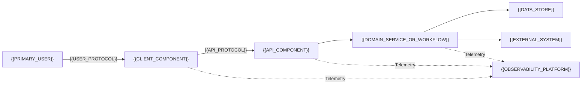
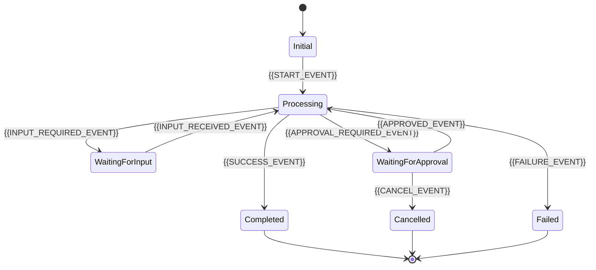

# {{PROJECT_NAME}} 技術設計書

<!-- README.md の規約に従ってプレースホルダーを置換し、不要なコメントと節を削除する。 -->

## 文書情報

| 項目 | 内容 |
| --- | --- |
| ステータス | {{STATUS}} |
| 最終更新日 | {{DATE}} |
| 対象フェーズ | {{TARGET_PHASE}} |
| オーナー | {{DOCUMENT_OWNER}} |
| 関連文書 | [仕様書](spec.md)、[タスク一覧](tasks.md)、[テスト仕様書](tests.md)、[データモデル](data-model.md) |

## 1. 設計目標

- {{DESIGN_GOAL_1}}
- {{DESIGN_GOAL_2}}
- {{DESIGN_GOAL_3}}

### 1.1 設計原則

- 認証、認可、入力検証を業務処理の前に行う。
- 副作用のある処理は冪等性を持たせ、結果不明時に重複実行しない。
- 外部依存を境界で抽象化し、ローカルではモックへ差し替えられるようにする。
- 設定と秘密情報を分離し、秘密情報をリポジトリへ保存しない。
- ログ、メトリクス、トレースで主要な処理を追跡できるようにする。

### 1.2 技術的制約

| ID | 制約 | 理由 |
| --- | --- | --- |
| CON-001 | {{TECHNICAL_CONSTRAINT}} | {{CONSTRAINT_REASON}} |

## 2. 技術スタック

| 領域 | 技術 | 用途 | 選定理由 |
| --- | --- | --- | --- |
| クライアント | {{CLIENT_TECH}} | {{CLIENT_PURPOSE}} | {{CLIENT_RATIONALE}} |
| バックエンド | {{BACKEND_TECH}} | {{BACKEND_PURPOSE}} | {{BACKEND_RATIONALE}} |
| データストア | {{DATA_STORE}} | {{DATA_PURPOSE}} | {{DATA_RATIONALE}} |
| 認証 | {{AUTH_PROVIDER}} | 認証と認可 | {{AUTH_RATIONALE}} |
| 実行基盤 | {{DEPLOYMENT_TARGET}} | アプリの実行 | {{DEPLOYMENT_RATIONALE}} |
| 監視 | {{OBSERVABILITY_PLATFORM}} | ログ、メトリクス、トレース | {{OBSERVABILITY_RATIONALE}} |

## 3. アーキテクチャ

### 3.1 概要

- {{ARCHITECTURE_SUMMARY_1}}
- {{ARCHITECTURE_SUMMARY_2}}
- {{ARCHITECTURE_SUMMARY_3}}



### 3.2 信頼境界とネットワーク

| 境界 | 内部 | 外部 | 保護方法 |
| --- | --- | --- | --- |
| 利用者境界 | {{CLIENT_COMPONENT}} | {{PRIMARY_USER}} | {{USER_AUTHENTICATION}} |
| API 境界 | {{API_COMPONENT}} | クライアント | {{API_PROTECTION}} |
| サービス境界 | {{DOMAIN_SERVICE_OR_WORKFLOW}} | 外部システム | {{SERVICE_AUTHENTICATION}} |
| データ境界 | {{DATA_STORE}} | アプリケーション | {{DATA_ACCESS_CONTROL}} |

ネットワーク公開範囲、ingress、egress、ファイアウォール、Private Endpoint の採否を記載する。採用しない項目も明示する。

## 4. コンポーネント設計

| コンポーネント | 責務 | 入力 | 出力 | 依存先 |
| --- | --- | --- | --- | --- |
| {{CLIENT_COMPONENT}} | {{CLIENT_RESPONSIBILITY}} | {{CLIENT_INPUT}} | {{CLIENT_OUTPUT}} | {{CLIENT_DEPENDENCY}} |
| {{API_COMPONENT}} | {{API_RESPONSIBILITY}} | {{API_INPUT}} | {{API_OUTPUT}} | {{API_DEPENDENCY}} |
| {{DOMAIN_SERVICE_OR_WORKFLOW}} | {{SERVICE_RESPONSIBILITY}} | {{SERVICE_INPUT}} | {{SERVICE_OUTPUT}} | {{SERVICE_DEPENDENCY}} |

### 4.1 クライアント

- {{CLIENT_DESIGN_ITEM_1}}
- {{CLIENT_DESIGN_ITEM_2}}
- 処理中、空状態、成功、失敗、再試行の表示を持つ。
- 認可判断をクライアントだけで行わない。

### 4.2 API・BFF

- {{API_DESIGN_ITEM_1}}
- {{API_DESIGN_ITEM_2}}
- 認証済み利用者を信頼できる認証情報から取得する。
- 入力検証、認可、相関 ID、冪等性を共通化する。

### 4.3 ドメインサービス・ワークフロー

- {{DOMAIN_DESIGN_ITEM_1}}
- {{DOMAIN_DESIGN_ITEM_2}}
- 状態遷移と副作用の実行条件を明示する。
- 外部システムのエラーをドメイン上の失敗へ変換する。

### 4.4 AI・Agent

<!-- AI や Agent を使用しない場合は削除する。 -->

| Agent または処理 | 責務 | 使用可能なツール | 禁止事項 |
| --- | --- | --- | --- |
| {{AGENT_NAME}} | {{AGENT_RESPONSIBILITY}} | {{ALLOWED_TOOLS}} | {{PROHIBITED_ACTIONS}} |

- Agent 間の受け渡しにはバージョン付きの構造化データを使用する。
- ツールは必要な Agent だけへ紐付ける。
- 外部コンテンツを信頼済み命令として扱わない。
- 副作用のあるツールは明示承認と入力検証後にのみ呼び出す。

## 5. 処理フローと状態



| 状態 | 説明 | 入場条件 | 許可する操作 | 終了条件 |
| --- | --- | --- | --- | --- |
| `{{STATE_NAME}}` | {{STATE_DESCRIPTION}} | {{ENTRY_CONDITION}} | {{ALLOWED_ACTION}} | {{EXIT_CONDITION}} |

## 6. API 設計

API の正式な契約は OpenAPI、Protocol Buffers、GraphQL Schema などの機械可読な形式でも管理する。

| Method | Path | 用途 | 認証 | 冪等性 |
| --- | --- | --- | --- | --- |
| `POST` | `{{CREATE_PATH}}` | {{CREATE_PURPOSE}} | 必須 | 必須 |
| `GET` | `{{GET_PATH}}` | {{GET_PURPOSE}} | 必須 | 不要 |
| `PATCH` | `{{UPDATE_PATH}}` | {{UPDATE_PURPOSE}} | 必須 | 条件付き |

### 6.1 共通ルール

- クライアントから渡された利用者 ID を認可判断に使用しない。
- ID が推測困難であっても、すべての保護対象で認可を検証する。
- エラーは `code`、`message`、`correlation_id`、`retryable` を持つ共通形式にする。
- 更新競合を検出し、黙って上書きしない。
- 入力サイズ、文字種、列挙値、ネスト深度に上限を設ける。

## 7. データ設計

詳細は [データモデル](data-model.md) に記載する。

- 正本となるデータストアを明示する。
- データ所有者とアクセスパターンに基づいてキーまたはパーティションを設計する。
- スキーマバージョンと移行方式を定義する。
- 競合制御、トランザクション、冪等性の境界を定義する。
- 保持期間と削除方法をデータ分類ごとに定義する。

## 8. 認証と認可

### 8.1 利用者認証

1. {{AUTH_PROVIDER}} が {{PRIMARY_USER}} を認証する。
2. {{API_COMPONENT}} が認証済み ID を信頼できる経路から取得する。
3. データアクセス前に、所有権またはロールを検証する。
4. ローカル認証モックは開発環境だけで使用可能にする。

### 8.2 サービス間認証

| 呼び出し元 | 呼び出し先 | 認証方式 | 必要権限 |
| --- | --- | --- | --- |
| {{CALLER_SERVICE}} | {{TARGET_SERVICE}} | {{SERVICE_AUTH_METHOD}} | {{MINIMUM_PERMISSION}} |

### 8.3 監査

- {{AUDITED_ACTION}} の実行者、日時、対象、結果を記録する。
- ログに秘密情報と不要な個人情報を含めない。
- 監査データの改ざん防止と保持期間を定義する。

## 9. 外部連携

| 外部システム | 用途 | タイムアウト | 再試行 | 結果不明時の処理 |
| --- | --- | --- | --- | --- |
| {{EXTERNAL_SYSTEM}} | {{INTEGRATION_PURPOSE}} | {{TIMEOUT}} | {{RETRY_POLICY}} | {{UNKNOWN_RESULT_POLICY}} |

- 外部応答を型と業務ルールで検証する。
- 一時障害と恒久障害を区別する。
- 副作用のある処理には冪等性キーを使用する。
- 再試行前に既存結果を照会できるようにする。

## 10. エラー処理と回復

| 対象 | 方針 | 利用者への影響 |
| --- | --- | --- |
| 入力検証 | {{VALIDATION_POLICY}} | {{VALIDATION_USER_EXPERIENCE}} |
| データストア | {{DATA_FAILURE_POLICY}} | {{DATA_FAILURE_USER_EXPERIENCE}} |
| 外部システム | {{EXTERNAL_FAILURE_POLICY}} | {{EXTERNAL_FAILURE_USER_EXPERIENCE}} |
| ストリーミング | {{STREAM_FAILURE_POLICY}} | {{STREAM_FAILURE_USER_EXPERIENCE}} |

再試行回数、バックオフ、タイムアウトは設定として管理し、無制限に再試行しない。

## 11. 可観測性

- W3C Trace Context などの標準形式で相関情報を伝播する。
- {{OBSERVABILITY_PLATFORM}} へ構造化ログ、メトリクス、トレースを送信する。
- {{KEY_METRIC_1}}、{{KEY_METRIC_2}}、{{KEY_METRIC_3}} を監視する。
- 個人情報、秘密情報、入力・出力本文の収集方針を明示する。
- 監視基盤の障害が業務処理を停止させないようにする。

## 12. 構成管理とデプロイ

### 12.1 ディレクトリ構成

```text
.
├── {{CLIENT_DIRECTORY}}/       # {{CLIENT_COMPONENT}}
├── {{BACKEND_DIRECTORY}}/      # {{API_COMPONENT}}
├── {{INFRA_DIRECTORY}}/        # Infrastructure as Code
├── specs/                      # プロジェクト固有の仕様・設計
└── {{OTHER_DIRECTORY}}/        # {{OTHER_PURPOSE}}
```

### 12.2 環境

| 環境 | 用途 | 外部依存 | データ |
| --- | --- | --- | --- |
| Local | 開発と単体テスト | 原則モック | 固定テストデータ |
| Integration | 結合テスト | テスト用実サービス | テスト専用データ |
| Production | 本番利用 | 本番サービス | 本番データ |

### 12.3 デプロイ

- {{INFRASTRUCTURE_AS_CODE_TOOL}} でインフラストラクチャを定義する。
- 環境差分はパラメーターで表現する。
- 認証、権限、監視、アラートもコードで管理する。
- ロールバックまたは前バージョンへの復旧手順を定義する。

## 13. 技術判断

| ID | 判断事項 | 選択肢 | 決定 | 状態・期限 |
| --- | --- | --- | --- | --- |
| ADR-001 | {{DECISION_TOPIC}} | {{OPTIONS}} | {{DECISION}} | {{DECISION_STATUS}} |

重要な判断は別の ADR ファイルへ分割してもよい。

## 14. リスク

| ID | リスク | 影響 | 発生可能性 | 対策 | オーナー |
| --- | --- | --- | --- | --- | --- |
| RISK-001 | {{RISK}} | {{IMPACT}} | {{LIKELIHOOD}} | {{MITIGATION}} | {{OWNER}} |

## 15. 確認事項

| ID | 確認事項 | 担当者 | 期限 | 状態 |
| --- | --- | --- | --- | --- |
| Q-001 | {{OPEN_QUESTION}} | {{OWNER}} | {{DUE_DATE}} | 未決 |
